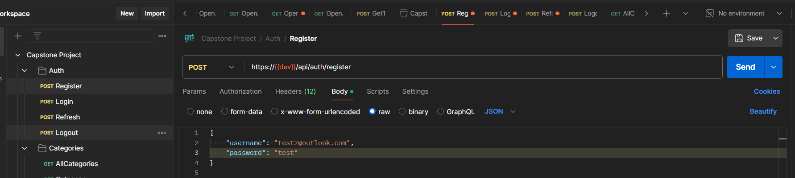
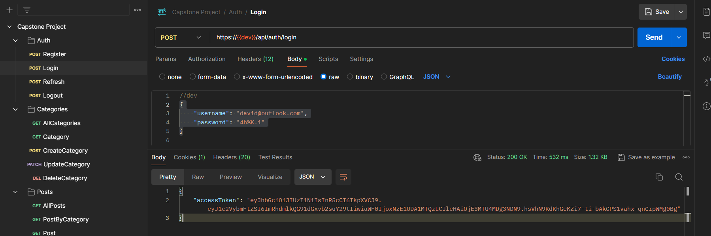

# React - Discovering the World App

## Instructions

1. Fork [mfee-project repository](https://github.com/gus-code/mfee-project).
2. Make sure to fork all the branches (You need to unselect the checkbox of fork only main branch).
3. You can clone the repository to your local or you can create a codespace in github.
4. Checkout to branch `<your_eid>` this is the starter boilerplate
   - `git checkout <your_eid>`
5. We will be working with some examples during the sessions in this same repository, once we finish with the session you can get the example from the branch `react/session-*` and merge it to your branch (We will provide the branch after each session)
   - `git merge react/session-*`
6. Each session branch will have the challenges to accomplish and the expected results.
7. After finish the challenges you need to create a pull request to the base repository, you will have a branch with your EID (`<your_eid_here>`). If you don't know how to do it you can check this [quick guide](#create-pull-request)

## Recommendations

- Before make your commit format your files with prettier

### Recommended extensions

- Name: Error Lens
  Id: usernamehw.errorlens
  Description: Improve highlighting of errors, warnings and other language diagnostics.
  Version: 3.17.0
  Publisher: Alexander
  VS Marketplace Link: https://marketplace.visualstudio.com/items?itemName=usernamehw.errorlens

- Name: Pretty TypeScript Errors
  Id: YoavBls.pretty-ts-errors
  Description: Make TypeScript errors prettier and more human-readable in VSCode
  Version: 0.5.4
  Publisher: yoavbls
  VS Marketplace Link: https://marketplace.visualstudio.com/items?itemName=yoavbls.pretty-ts-errors

- Name: ES7+ React/Redux/React-Native snippets
  Id: dsznajder.es7-react-js-snippets
  Description: Extensions for React, React-Native and Redux in JS/TS with ES7+ syntax. Customizable. Built-in integration with prettier.
  Version: 4.4.3
  Publisher: dsznajder
  VS Marketplace Link: https://marketplace.visualstudio.com/items?itemName=dsznajder.es7-react-js-snippets

## How to

### Run postman collection

1. Download postman collection from `apps/react/assets/Capstone-Project.postman_collection`
2. Import collection to postman
3. Register a new user using the "register" API, inside the "Auth" folder
   
4. Use the credentials to generate a token using the "login" API
   
5. Configure accestoken variable. After updating the value you need to save it with `Ctrl + S`
   
